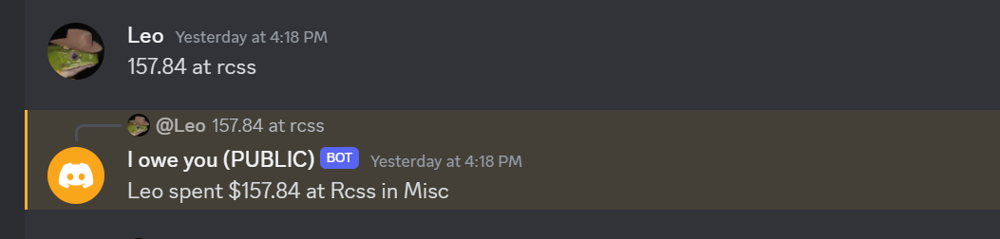
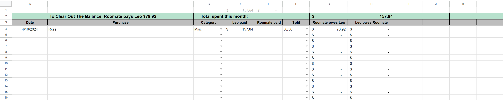
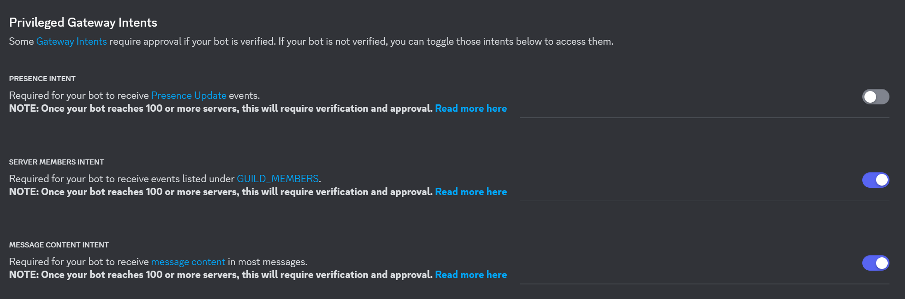
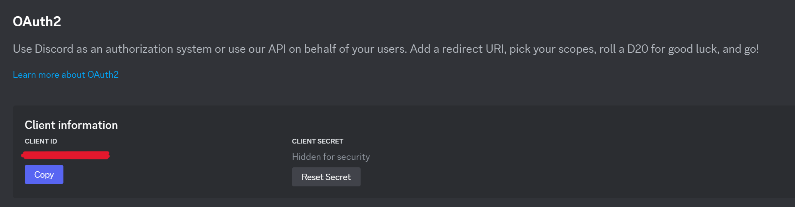

# I Owe You Discord Bot

**A Discord bot to keep track of who owes who money.**

This bot keeps track of your financial exchanges with a roommate or friend, storing data securely in a Google Sheets file. It allows for easy submission of new entries and quick balance checks, all within your Discord server.




## Why Use This Bot?

This bot was designed to simplify expense tracking for two individuals. It eliminates the need to manually update a shared spreadsheet and allows for quick entry submissions using voice dictation on your phone.

## Designed for Ease of Use

I found it annoying to directly update a shared spreadsheet after making purchases, especially when I was out. Often, I'd forget to update it later when I got home to my computer.

This bot simplifies that process. Short commands and message parsing allow for quick entry submissions, making it easier to keep track of shared expenses, even when you're on the go. You can submit entries using voice dictation on your phone or by simply typing in the details.

## Submitting Entries

Messages are parsed using regular expressions and consist of four parts:

-   `Name (optional)` - The name of the person who made the purchase, this can be the name / nickname of the other person to submit a purchase on their behalf. If no name is specified or found, it will default to the author of the message
-   `Amount (required)` - The first occurrence of a decimal or whole number is assumed to be the amount
-   `Description (required)` - Text that excludes the name, amount, and category will be used as the description
-   `Category (optional)` - Text that matches one of the configured categories / category keywords will be used as the category. If no category is found, it will fallback to the default category

### Full length messages

```
John spent $12.48 for Netflix in subscriptions
```

### Short messages

The example above can be shortened to:

```
12.48 Netflix
```

## Commands

`/balance` - Shows the current balance of the user

`/pay` - Add an entry to pay off any outstanding balances

# Installation

This bot requires self-hosting.

### Creating a service account

A service account is required to access the Google Sheets API. Follow the instructions [here](https://theoephraim.github.io/node-google-spreadsheet/#/guides/authentication?id=setting-up-your-quotapplicationquot) to create a service account and download the JSON file.

**Make sure not to commit this file to source control.**

Only the `client_email` and `private_key` fields are required from the JSON file. Add these to your `.env` file.

## Setting up the spreadsheet

-   Create a copy of the spreadsheet from [here](https://docs.google.com/spreadsheets/d/1q5OcvyquNueBPlrWIpHoLVws0KlqHMnxC8Mc56Tnki8/copy#gid=1759934342)
-   Share the spreadsheet with the `client_email` value, make sure to give it **Edit** permissions
-   Populate the cells found in the `Configuration` worksheet.
-   Copy the `Spreadsheet ID` from the URL of the spreadsheet and add it to your `.env` file

```
https://docs.google.com/spreadsheets/d/<SPREADSHEET ID>/edit#gid=0
```

## Running the bot

-   Clone the repository
-   Create a `.env` file in the root directory with the content found in [.env.example](.env.example)

    ### Local development

-   Run `npm install`
-   Run `npm run dev`

    ### Production

-   Run `npm build`, followed by `npm start`
-   Hosting on a service such as Railway or Render is recommended. Make sure to set the environment variables in the hosting service.

## Setting up in your server

-   Create a new Discord application and bot [here](https://discord.com/developers/applications)
-   Copy the bot token and add it to your `.env` file
-   Under `Bot`, enable `SERVER MEMBERS INTENT` and `MESSAGE CONTENT INTENT`
    
-   Under `OAuth2`, select the client ID and add it to your `.env` file
    
-   Finally, head to `Installatation`. Set `Install link` to `Discord provided link` and use it to invite the bot to your server
-   Create a text channel strictly for the bot to post messages in. This is where the bot will post balance updates and other messages. Restrict permissions to only allow the bot to send messages in this channel.
